
## Инструкции при возникновении ошибок при запуске 

>**Не решили свою проблему или появился вопрос? Вы можете прочитать [здесь](https://github.com/MyEasySite/Monster-Crush-AUTO-RPG/blob/main/SECURITY.md)**

1. Ошибка первая:

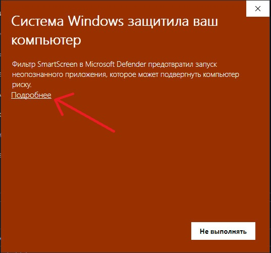

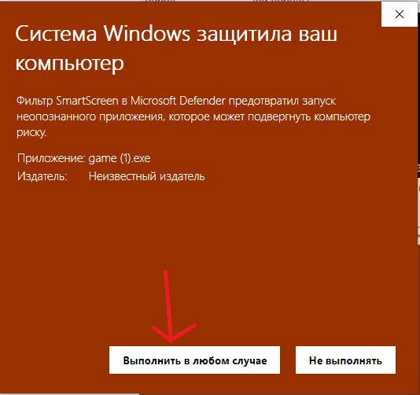

2. Ошибка вторая:

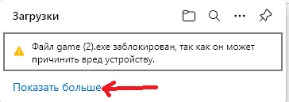

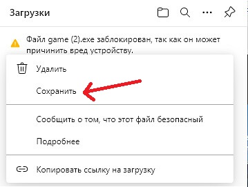

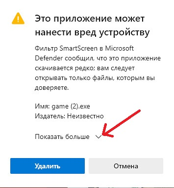

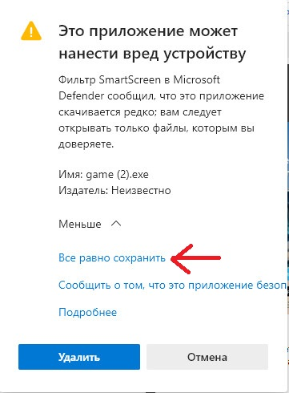

3. Ошибка третья:

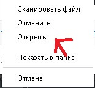

**ИЛИ**

>**Вам нужно отключить Защитник Windows**

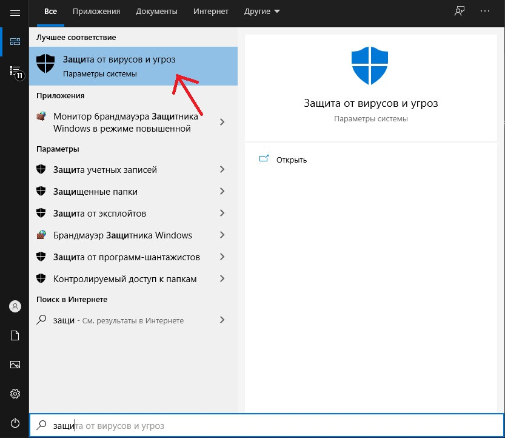

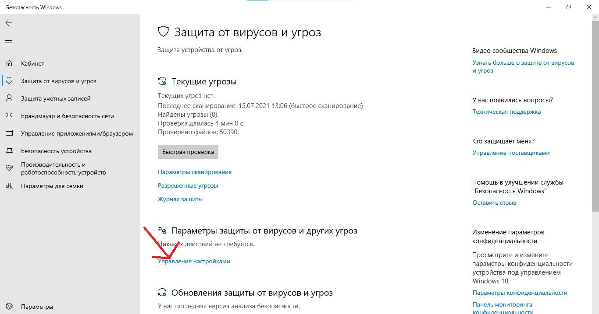

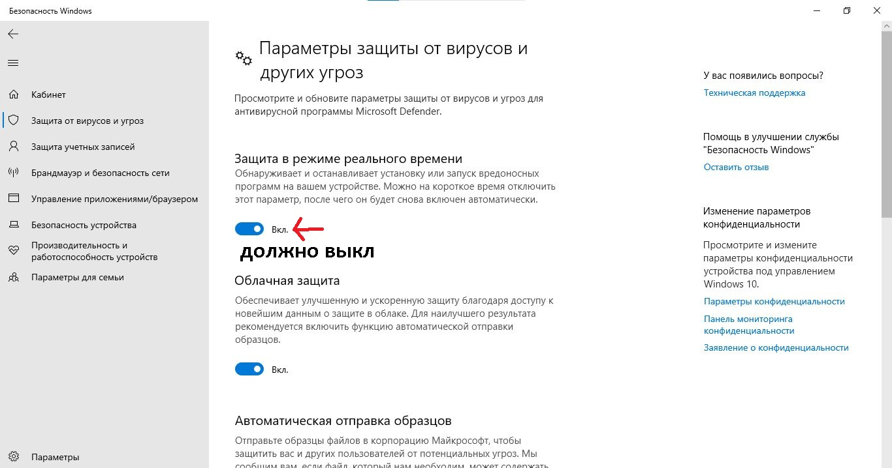

4. Ошибка четвертая:

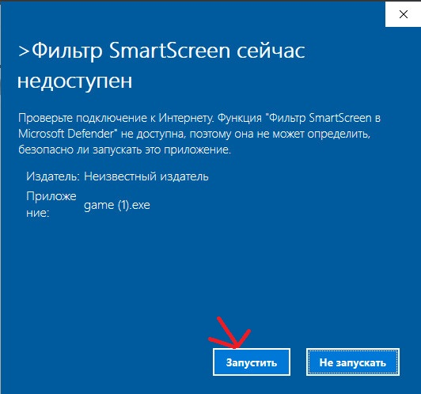

