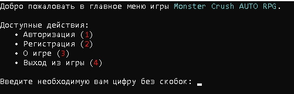
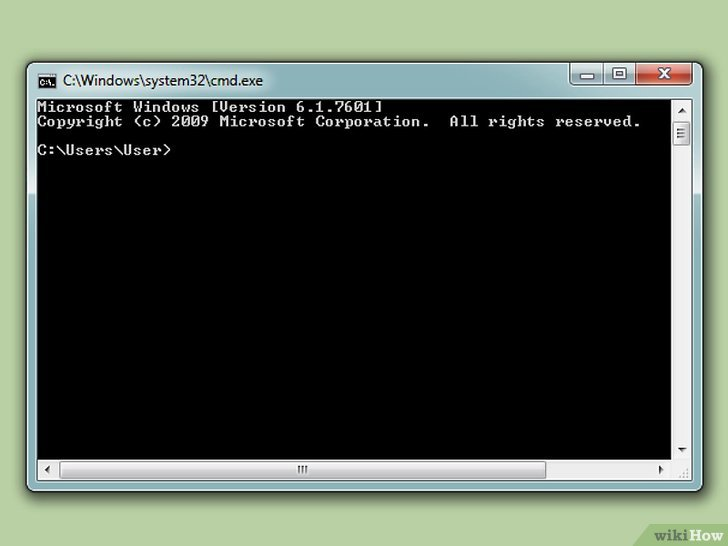
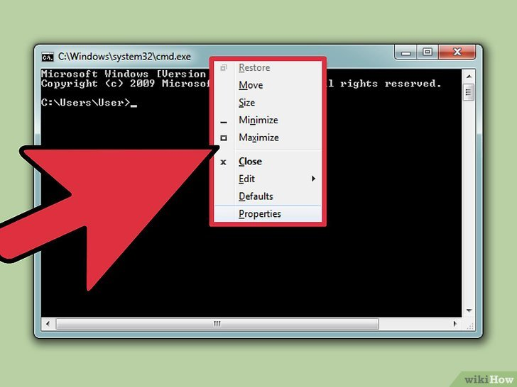
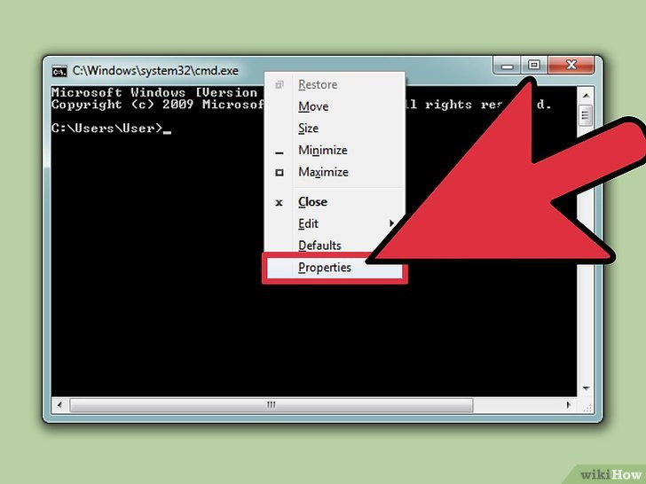
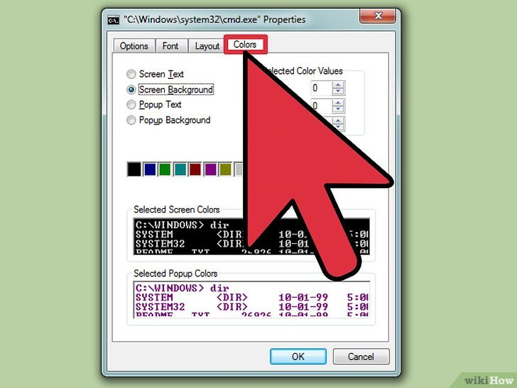
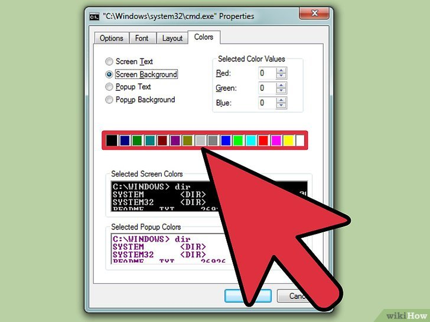
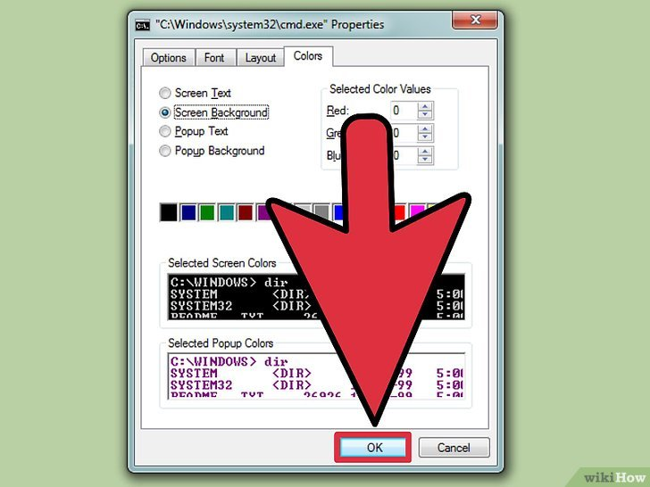

<h1 align="center">Monster-Crush-AUTO-RPG</h1>

Monster Crush AUTO RPG - это полностью консольная автоматическая или «самоиграющая» игра, написанная на языках программирования **Python** и **MySQL**.

## Установка
Скачайте файл [**game.exe**](https://github.com/MyEasySite/Monster-Crush-AUTO-RPG/releases/tag/v1.0) справа в разделе релизы.

## Как играть?
>**Перед началом началом использования рекомендуется в консоли сменить фон на черный.**
>>Смотрите инструкцию [здесь](#инструкция)

При запуске предлагается авторизация или регистрация аккаунта, это значит что создав аккаунт однажды, можно будет использовать его неограниченное количество раз.

Действие **"О игре"** - предоставляет возможность прочитать основную информацию о игре.
 Действие **"Выход из игры"** - говорит сам за себя.

После после прохождения аутентификации вам больше ничего не нужно делать. Как было сказано игра автоматическая или «самоиграющая».

Нужно выйти из игры? Просто закройте ееё. Все данные сохранятся.

>**ВНИМАНИЕ: ЗАПОМНИТЕ СВОИ ДАННЫЕ ДЛЯ АВТОРИЗАЦИИ АККАУНТА. В СЛУЧАЕ ПОТЕРИ ДАННЫХ ДЛЯ АВТОРИЗАЦИИ  АККАУНТА - ВОЗМОЖНОСТЬ ИХ ВОССТАНОВЛЕНИЯ ПРЕДОСТАВЛЯТЬСЯ НЕ БУДЕТ.
 Также в случае потери данных авторизации аккаунта у вас есть возможность зарегистрировать новый аккаунт.
 Регистрация и владение несколькими аккаунтами разрешается; регистрация новых аккаунтов неограничена.**

## Сюжет
Другой мир, что носит название «Кроминонг», нуждается в спасении от сил зла. Призываются авантюристы со всего Кроминонга.  Вы готовы стать одним из них?
Сможете ли вы забраться на 100-ый этаж Небесного Лабиринта и искоренить зло в Кроминонге?

 
## Целевая аудитория
Офисные работники, старшие школьники и студенты, имеющие свободный доступ к компьютеру, а также мечту об становлении авантюристом, независимо от пола.

 
## Инструкция по смене фона в консоли
1. Запустите командную строку.

2. Щелкните сверху правой кнопкой мыши.

3. Выберите «Свойства».

4. Перейдите на вкладку «Цвета».

5. Выберите черный фон.

6. Щелкните по кнопке «OK» для сохранения изменений.

